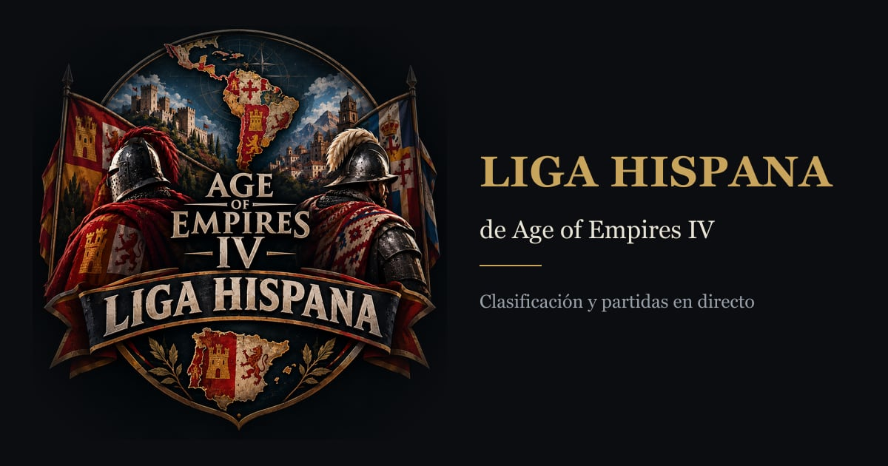
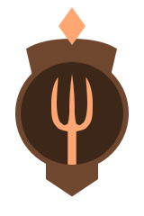
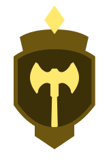
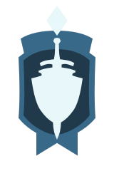
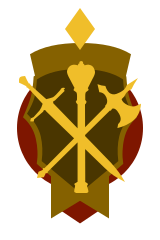

<p align="center">
  
</p>

<h1 align="center">Liga Hispana · Age of Empires IV</h1>

<p align="center">
  Seguimiento del torneo individual de Age of Empires IV: clasificación, partidas en directo,
  objetivos especiales, puntuación, streams de los participantes y reglas.
</p>

<p align="center">
  <a href="https://laligahispana.es"><b>Sitio en vivo</b></a> ·
  <a href="docs/REGLAS.md">Reglas</a> ·
  <a href="docs/PUNTUACION.md">Puntuación</a> ·
  <a href="docs/OBJETIVOS.md">Objetivos</a>
</p>

<p align="center">
  <a href="https://github.com/JavierrMadrid/LigaHispana_AOE4/actions/workflows/ci.yml">
    
  </a>
</p>

---

## Qué es

Un torneo **individual** de Age of Empires IV. No hay equipos: cada persona compite con su propia
cuenta y la clasificación se calcula **sola** a partir de las partidas que publica la API de
[AoE4World](https://aoe4world.com/api), sin que nadie apunte resultados a mano.

La web es el marcador del torneo: se entra a ver quién va primero, qué partidas están en juego ahora
mismo y quién está en directo.

## Qué ofrece la web

| Página | Qué se ve |
|---|---|
| **Clasificación** (`/`) | La tabla del torneo: puesto, puntos, victorias, división, quién está en directo y cuánto queda de torneo. |
| **Partidas** (`/partidas`) | Las partidas que están jugando los participantes en este momento. |
| **Objetivos** (`/objetivos`) | Los 38 objetivos especiales, cuántos puntos da cada uno y quién lo posee. |
| **Objetivos de un participante** (`/objetivos/<id>`) | El avance de un jugador en los 38 objetivos: qué ha conseguido, en cuál está al alcance y cuánto le falta para el primer puesto. |
| **Puntuación** (`/puntuacion`) | Cuánto vale cada victoria, qué cuenta como partida clasificatoria, los objetivos especiales y los desempates. |
| **Reglas** (`/reglas`) | Las normas del torneo: formato, participación, normas de obligado cumplimiento y organización. |
| **Participar** (`/participar`) | La inscripción pública al torneo. |

La organización tiene además un **panel de administración** para aprobar participantes, revisar
partidas y alertas, y gestionar el torneo.

## Cómo se compite

- **Individual, en la ladder *ranked*** del juego: 1v1 y ranked por equipos. El resto de modos no
  puntúa.
- **10 puntos por victoria**, más **38 objetivos especiales** que reparten puntos extra a quien va
  primero en cada uno.
- **Ventana de fechas**: solo cuentan las partidas jugadas dentro del periodo del torneo.
- **Transparencia**: la organización vigila comportamientos que podrían inflar la clasificación
  (abandonar para bajar de elo, rivales repetidos, equipos por debajo de la división…) y avisa para
  revisarlos.
- **Directos**: se detecta si un participante está transmitiendo en Twitch, YouTube o Kick.

Todo el detalle está en [`docs/REGLAS.md`](docs/REGLAS.md), [`docs/PUNTUACION.md`](docs/PUNTUACION.md)
y [`docs/OBJETIVOS.md`](docs/OBJETIVOS.md).

<p align="center">
  
  
  
  
  
  
</p>

---

## Especificaciones técnicas

Resumen de con qué está hecho. El detalle vive en [`docs/`](docs).

### Stack

| Capa | Elección |
|---|---|
| Framework | Next.js 16 (App Router) + TypeScript |
| Estilos | TailwindCSS v4, tokens en `src/app/globals.css` |
| Datos | PostgreSQL en Supabase + Prisma 7 (`prisma/schema.prisma`) |
| Auth | Supabase Auth, solo para el panel de administración |
| Datos externos | API de AoE4World; YouTube y Kick para los directos |
| Despliegue | Cloudflare Workers con OpenNext |

### Cómo funciona

```
Supabase Cron ──► Worker (Cloudflare) ──► API de AoE4World
                       │
                       ├──► YouTube / Kick (directos)
                       ▼
                  PostgreSQL (Supabase)
                       │
                       ▼
   Web: clasificación · partidas · objetivos · puntuación · reglas
                       ▲
                       └── Panel /admin (solo organización)
```

- El **reloj** es un job de `pg_cron` en la base de datos que dispara la sincronización cada 5 minutos;
  un workflow de GitHub queda como red de seguridad.
- El **motor de puntuación** lee las partidas guardadas, aplica el ruleset activo y escribe la
  clasificación. Se recalcula solo.
- Las **reglas y los puntos** son configurables sin desplegar (viven en la tabla `Setting`).

### Puesta en marcha

Requiere Node.js 20+ y una base de datos PostgreSQL.

```bash
npm install          # dependencias + cliente Prisma
cp .env.example .env # rellena DATABASE_URL
npm run db:push      # crea las tablas
npm run dev          # http://localhost:3000
```

### Comandos

| Comando | Qué hace |
|---|---|
| `npm run dev` | Servidor de desarrollo. |
| `npm run build` / `npm run start` | Build y arranque de producción. |
| `npm run lint` / `npm test` | ESLint y tests (Vitest). |
| `npm run sync` | Sincroniza partidas de AoE4World. |
| `npm run score` | Recalcula la clasificación. |
| `npm run db:push` / `npm run db:security` | Sincroniza el schema y aplica la postura de RLS. |
| `npm run db:cron` | Programa el reloj del torneo (Supabase Cron). |
| `npm run mock:tournament` | Simula el torneo con fixtures locales. |
| `npm run deploy` / `npm run preview` | Despliega el Worker (producción / local). |

### Despliegue

**Producción despliega sola**: el repositorio está conectado a Cloudflare Workers Builds. Un push a
`main` publica en `https://laligahispana.es`; un push a cualquier otra rama genera un **Preview** con
su propia URL. GitHub Actions comprueba lint, build y tests en cada pull request.

### Documentación

| Documento | Contenido |
|---|---|
| [`docs/REGLAS.md`](docs/REGLAS.md) | Normas para participar y reglas internas del torneo. |
| [`docs/PUNTUACION.md`](docs/PUNTUACION.md) | El sistema de puntuación: qué cuenta y cuánto vale. |
| [`docs/OBJETIVOS.md`](docs/OBJETIVOS.md) | Los 38 objetivos especiales, con sus puntos. |
| [`docs/MODELO-DATOS.md`](docs/MODELO-DATOS.md) | El esquema de la base de datos, tabla por tabla. |
| [`docs/DESPLIEGUE.md`](docs/DESPLIEGUE.md) | Producción y previews, variables, Hyperdrive y problemas conocidos. |
| [`docs/OPERACION.md`](docs/OPERACION.md) | Sincronización, alertas, simulaciones y operativa diaria. |

### Desarrollo con agentes

El trabajo se reparte entre dos subagentes, cada uno con su guía en `.opencode/agent/`:
`@design-ux` (interfaz y copy) y `@logic-data` (lógica, datos, auth y API). Las reglas de enrutado y
las convenciones del repositorio están en [`AGENTS.md`](AGENTS.md).

---

<p align="center">
  
</p>
